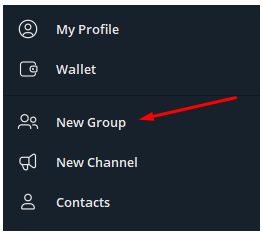
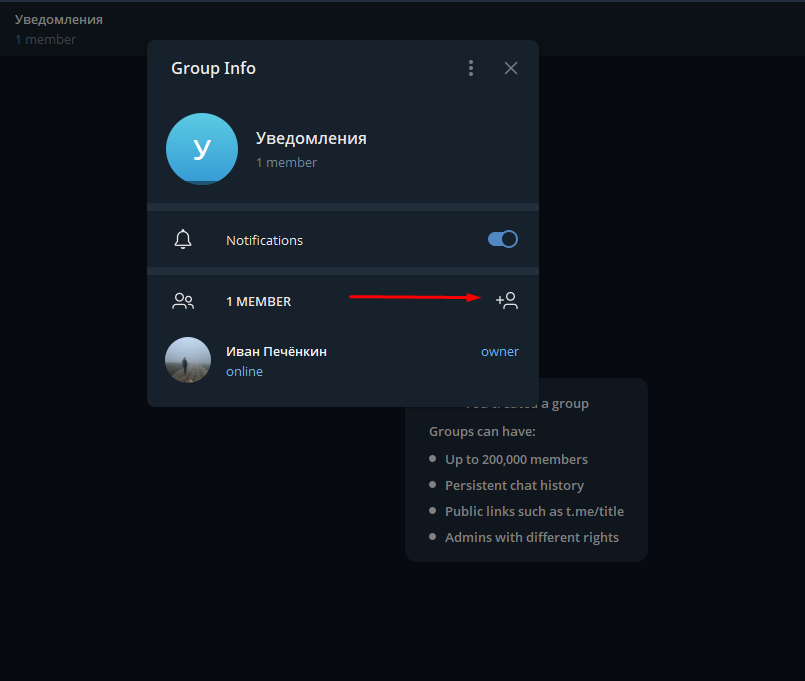
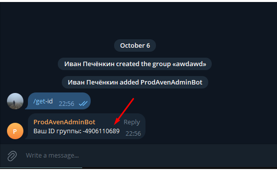
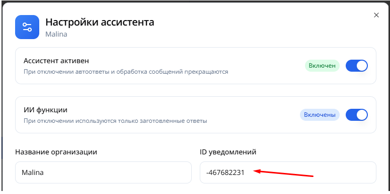
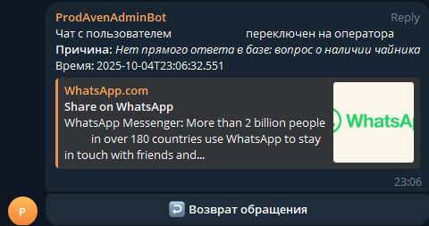
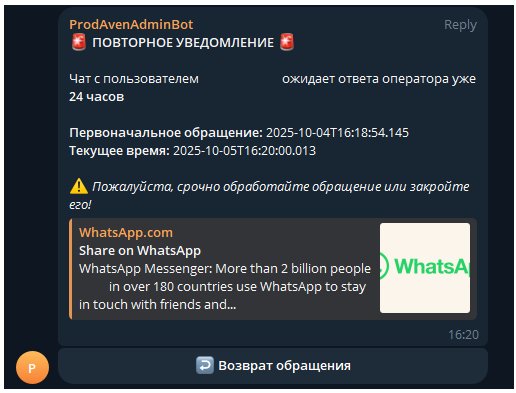

# Инструкция по настройке уведомлений в Telegram

Для получения уведомлений о переводах на оператора в Telegram необходимо настроить групповой чат с ботом.

## Создание группы и подключение бота

1. Откройте Telegram и создайте новую группу (New Group)

    

2. Добавьте в созданную группу бота @ProdAvenAdminBot

    

3. В чате с группой отправьте команду `/get-id`

    

4. Бот отправит вам ID чата. Скопируйте его полностью, включая знак минус, если он есть

5. Перейдите на страницу настроек вашего бота на платформе <a href="https://platform.avenbot.ru/dashboard" target="_blank">https://platform.avenbot.ru/dashboard</a>

6. Вставьте скопированный ID чата в соответствующее поле настроек

    

## Получение уведомлений

После настройки бот будет автоматически отправлять уведомления в групповой чат:

### Уведомление о переводе на оператора

При переводе диалога на оператора бот сразу отправит уведомление:

### Напоминание через 24 часа

Если диалог не был обработан, через сутки придет повторное уведомление:

