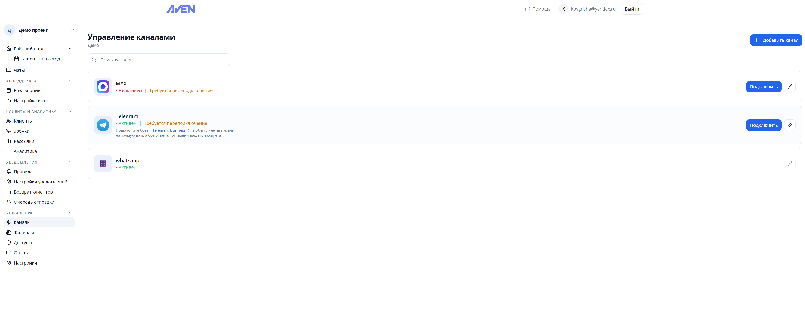
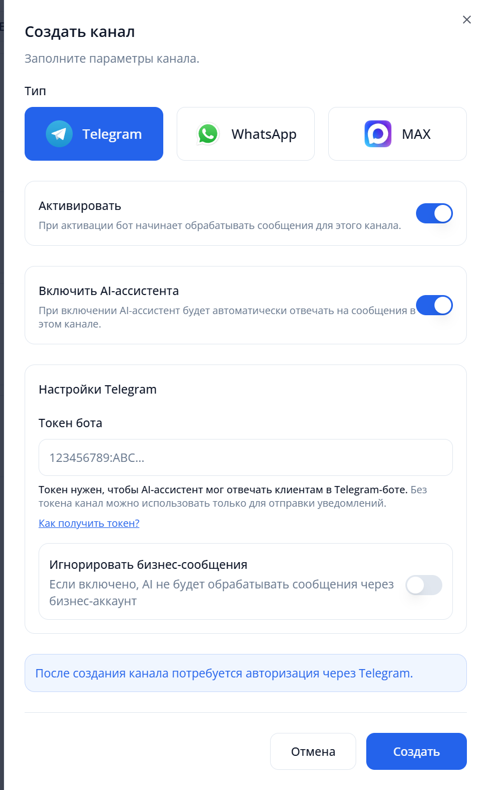
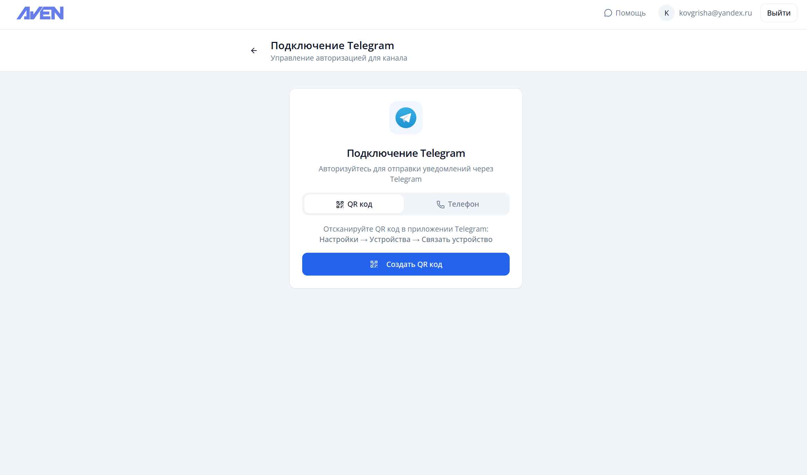
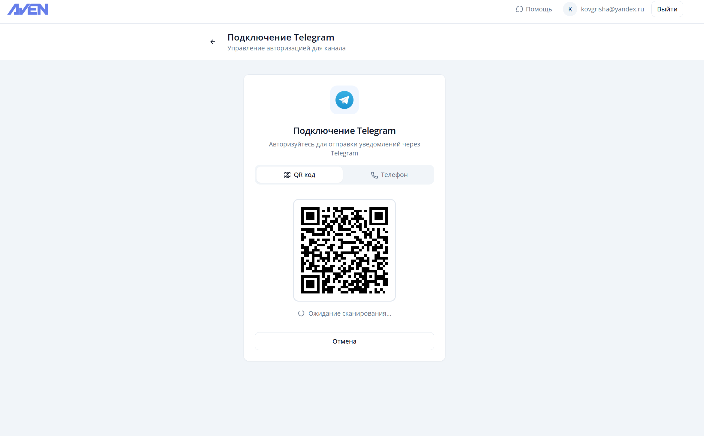

# Подключение Telegram

1. Перейдите в раздел "Каналы"

   

2. Нажмите "Добавить канал" и выберите тип Telegram

   

3. Создайте канал Telegram — если у вас нет бот-токена, система предложит привязку через номер телефона

   

4. Отсканируйте QR-код для авторизации

   

Для расширенной настройки через бот-токен и Telegram Business смотрите [инструкцию](./telegram.md).
