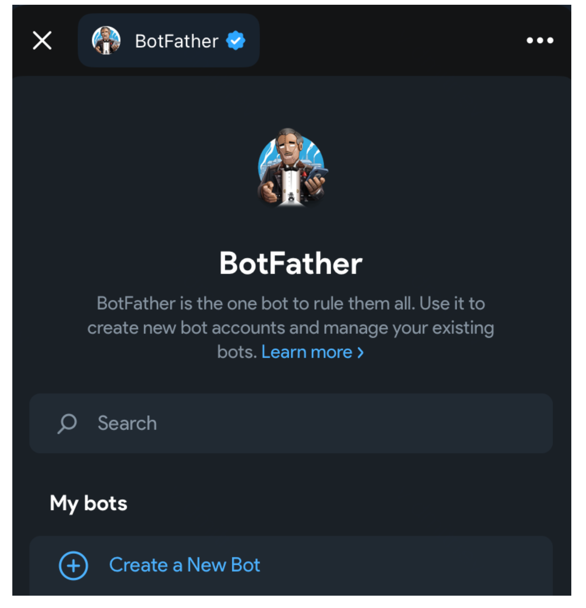
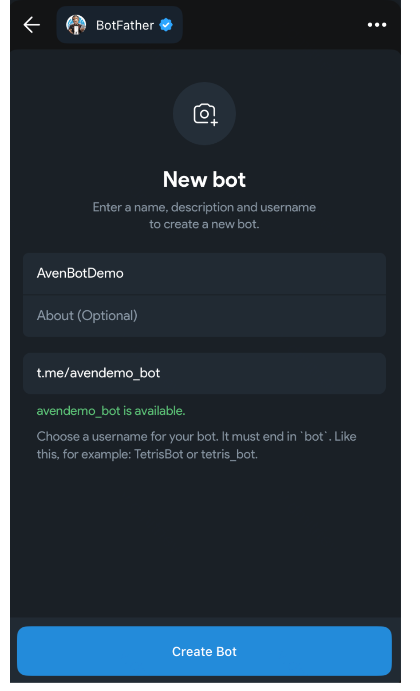
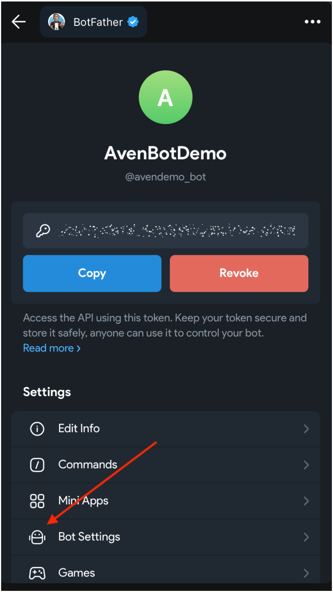
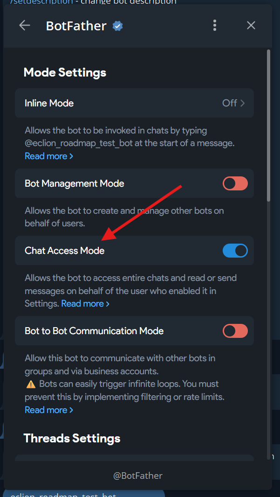
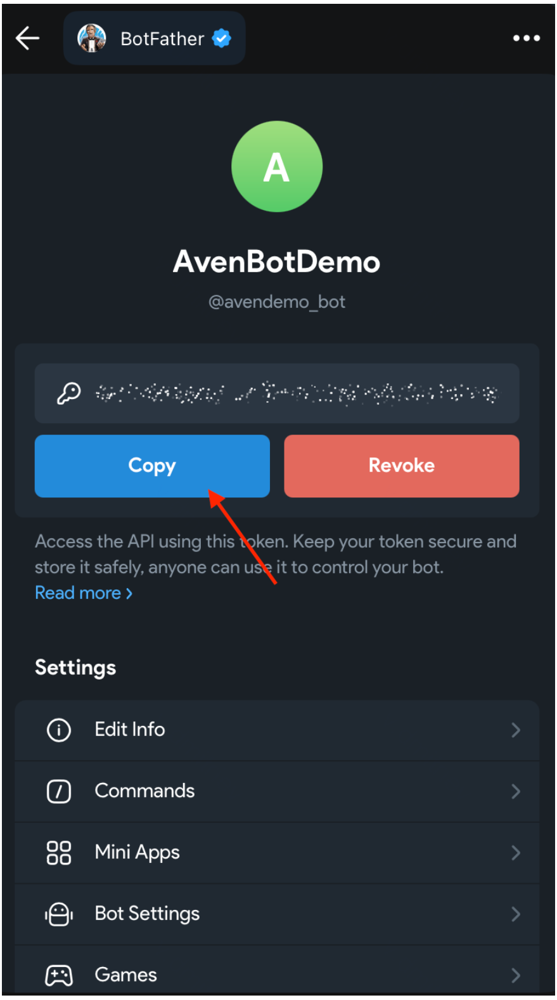
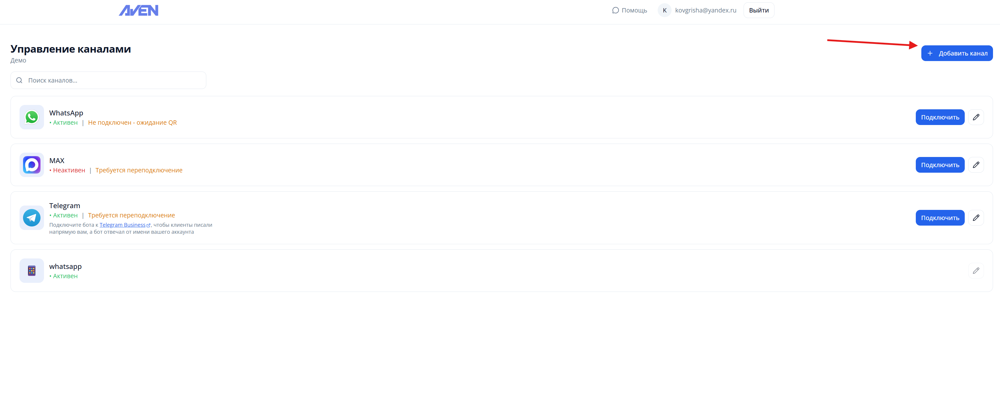
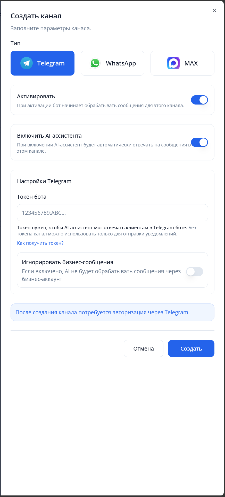
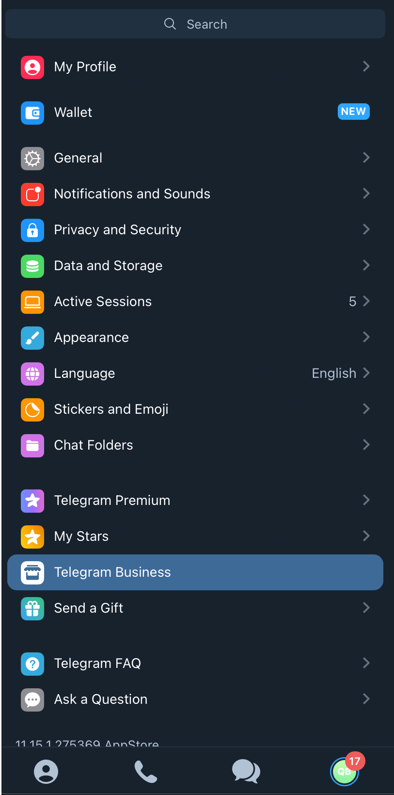
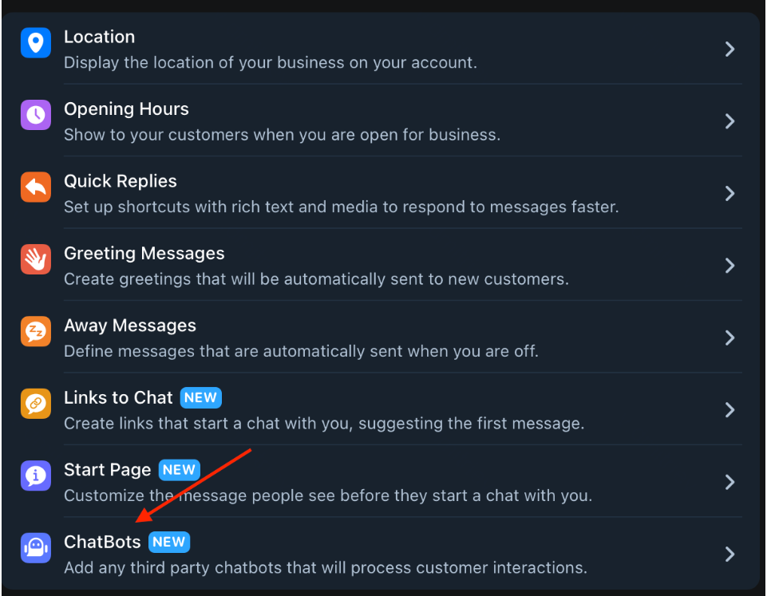
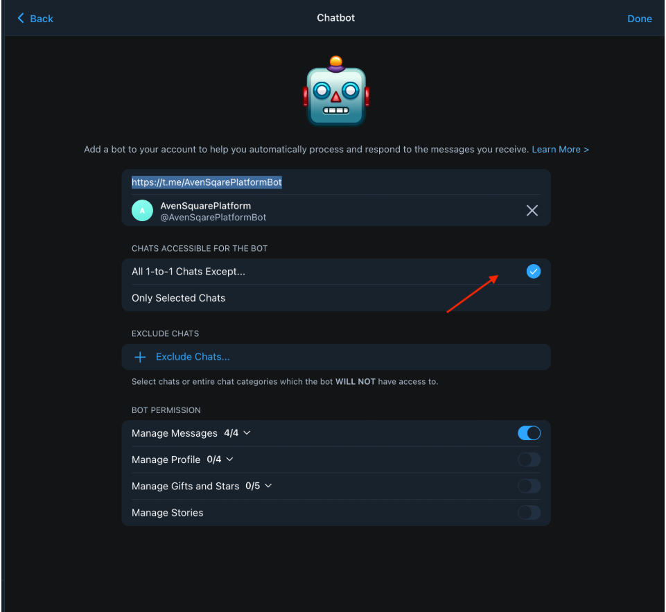

# Создание Telegram бота и подключение Business

Для корректной работы бота у вас должен быть подключен Telegram Premium (можно воспользоваться официальным ботом <a href="https://t.me/PremiumBot" target="_blank">https://t.me/PremiumBot</a>)

## Создание бота

1. Перейдите в [@BotFather](https://t.me/BotFather)

    

2. Запустите мини приложение и выберите добавление нового бота

    

3. Нужно заполнить все поля, после нажать на кнопку "Создать бота"

    

    

4. На появившемся экране перейдите в "Настройки бот", у бота обязательно должен быть включен "Business mode"

    

5. Перейдите на главный экран и скопируйте токен

## Подключение Telegram Business

1. Перейдите по адресу <a href="https://platform.avenbot.ru/dashboard" target="_blank">https://platform.avenbot.ru/dashboard</a> и добавьте новый канал связи

    

2. На странице нажмите "Добавить канал" и на странице выберите тип Telegram. В поле "Токен бота" вставьте скопированный ключ из [@BotFather](https://t.me/BotFather)

    

3. В приложении Telegram перейдите в настройки и выберите "Telegram Бизнес"

    

4. Перейдите в раздел "Чат боты"

    

5. Добавьте ссылку на своего бота и включите все 1-2-1 сообщения

    
