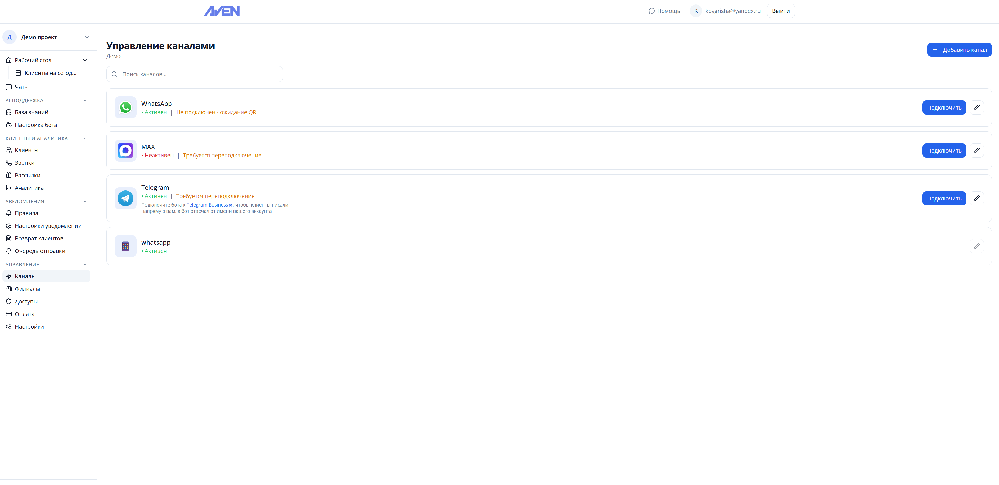
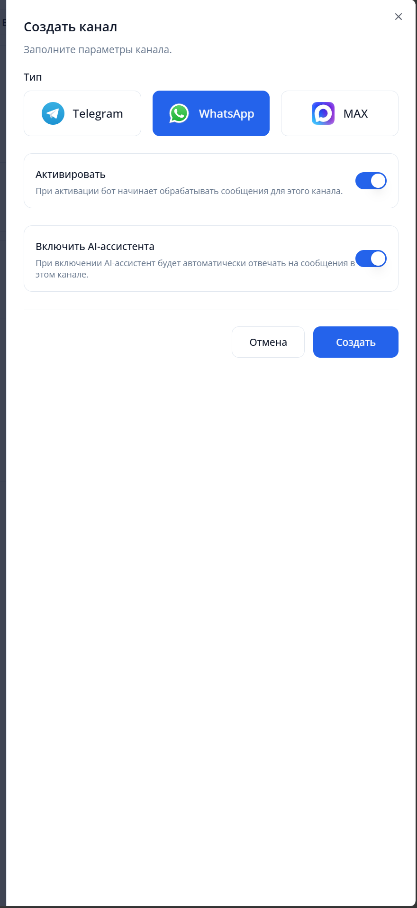
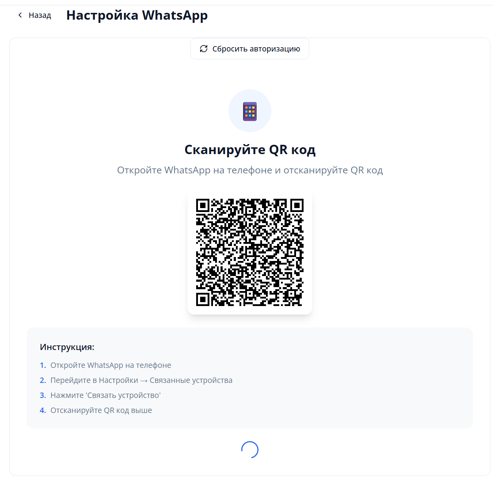

# Подключение WhatsApp

1. Перейдите на страницу управления вашими ботами <a href="https://platform.avenbot.ru/dashboard" target="_blank">https://platform.avenbot.ru/dashboard</a>

2. Для подключения вам нужно выбрать "Каналы"

    

3. На открывшейся странице нажмите кнопку "+ Добавить канал"

4. Выберите "Тип" -> WhatsApp и нажмите кнопку "Создать"

    

5. На странице управления каналами у вас появится новый канал WhatsApp

6. Нажмите на кнопку с QR-кодом

    

7. Отсканируйте QR-код на открывшейся странице через приложение WhatsApp

8. После успешного добавления отобразится статус подключения
