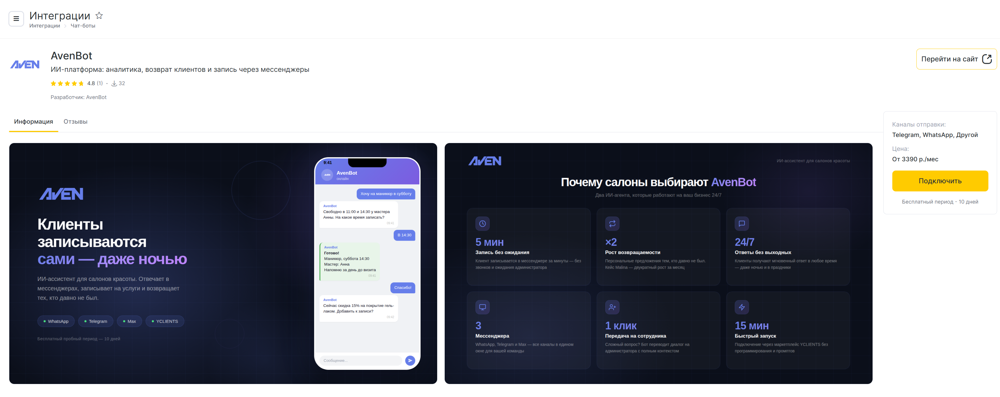
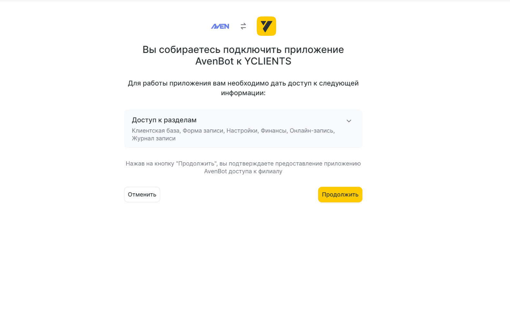
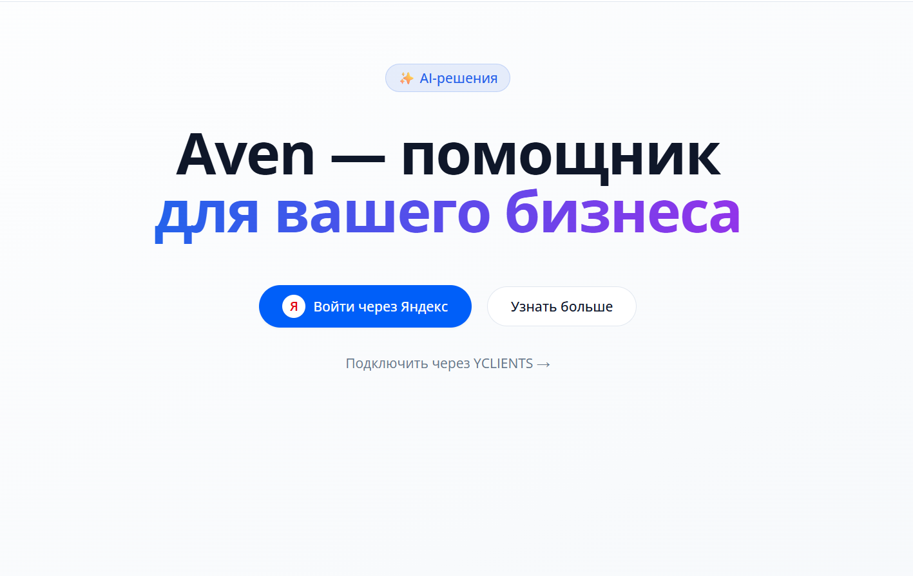
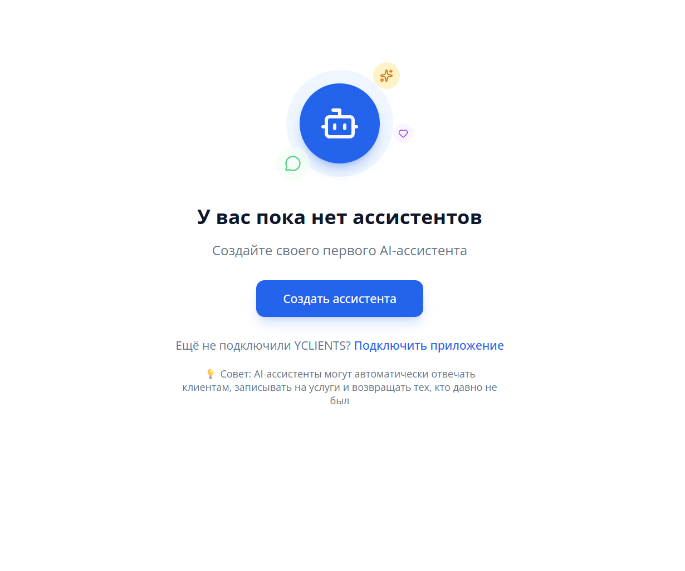

# Подключение к YClients

1. Перейдите в маркетплейс YClients и найдите приложение AvenBot, либо откройте <a href="https://platform.avenbot.ru" target="_blank">platform.avenbot.ru</a> и нажмите кнопку "Подключить"

2. В появившемся окне нажмите "Продолжить"

3. Авторизуйтесь через Яндекс аккаунт

4. После авторизации нажмите кнопку для создания ассистента

